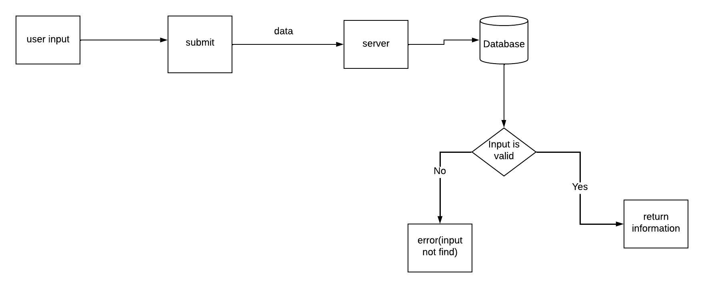
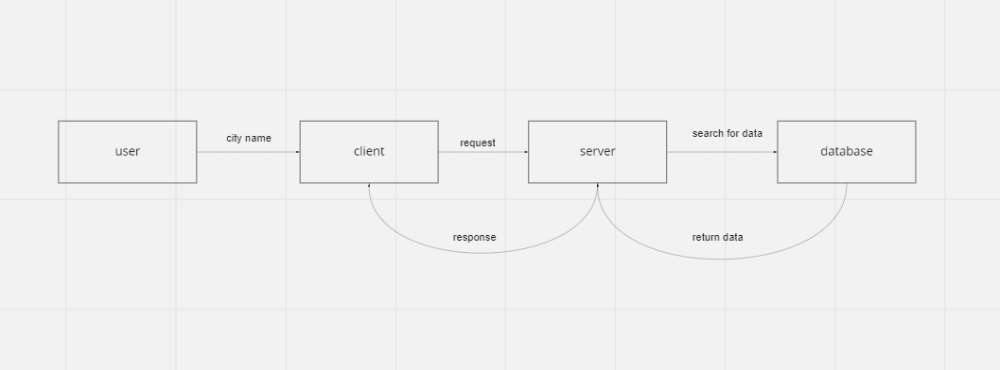

# Project Name

### Author: Fawzi Shiyyab 
### Version 1.0.0

---

# Overview
### Make web application to know about more city in world.

---

# Getting Starting
### Make repo and create react app

---

# Architecture
1. Axios
2. ReactJS
3. Bootstrap

---

# Change Log
---

# Credit and Collaborations

---

# Name of feature: Lab6 Axios install

city
# this is
=======

---

## name of feuture:map lab 6
## start time : 4pm
## end time : 10pm
## it take 6 hour
 
# Ahmad jubran my partner and help me in map 
 ## name of feuture:map lab 7
## start time : 4pm
## end time : 10pm
## it take 10 hour
 
# Ahmad jubran my partner and help me in map 
 ## name of feuture:map lab 8
## start time : 6pm
## end time : 10pm
## it take 4 hour
 
# Ahmad jubran my partner and help me in map 
 
